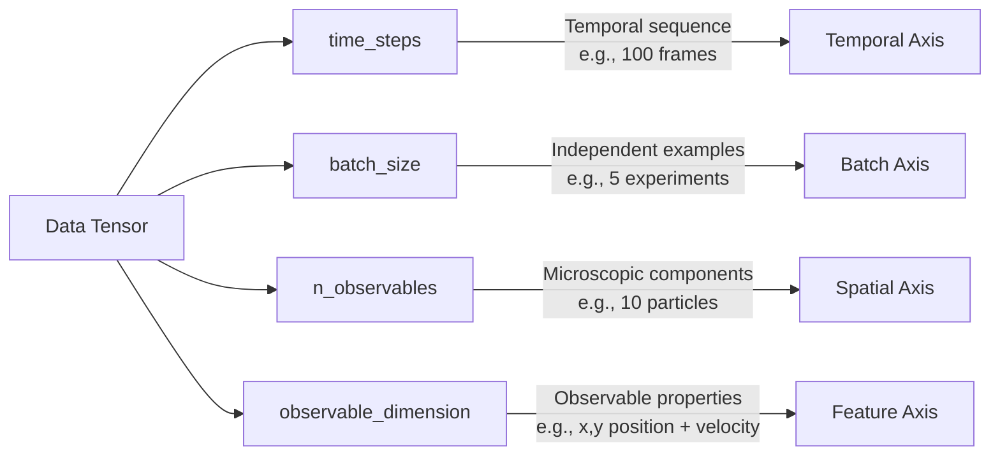

# Data Preparation for DMBD

This tutorial explains how to prepare your data for use with the Dynamic Markov Blanket Detection (DMBD) algorithm.

## Data Structure Requirements

DMBD requires data in a specific format to properly identify Markov blankets. The data tensor must be structured as follows:

```
data = torch.tensor(...).reshape(time_steps, batch_size, n_observables, observable_dimension)
```

Where:
- `time_steps`: Number of sequential time points
- `batch_size`: Number of independent sequences/examples
- `n_observables`: Number of microscopic components/observables
- `observable_dimension`: Dimension of each observable (e.g., position, velocity, etc.)

## Dimensions Explained



### Time Steps

This dimension represents the sequential time points of your data. DMBD analyzes how variables evolve over time to identify Markov blanket structures. More time steps generally lead to better identification of dynamic patterns:

- **Minimum**: At least 20-30 time steps for simple systems
- **Recommended**: 100+ time steps for complex systems
- **Maximum**: Limited by available memory

### Batch Size

Independent sequences or examples. You can use a batch size of 1 if you have a single example:

- For a single system, use `batch_size=1`
- For multiple independent systems, use `batch_size>1`

### Number of Observables

This dimension corresponds to the number of microscopic components that DMBD will categorize as environment, boundary, or object. These could be:

- Particles in a physical system
- Pixels in an image
- Neurons in a neural recording
- Agents in a simulation

### Observable Dimension

The dimension of each observable, which could include:

- Spatial coordinates (x, y, z positions)
- Velocities, accelerations
- Concentrations, activations
- Any other measurable property

## Data Preparation Examples

### Example 1: Particles in 2D Space

For particles moving in 2D space with position and velocity:

```python
import torch
import numpy as np

# Create data for 5 particles tracked over 100 time steps
# Each particle has x, y positions and velocities
time_steps = 100
batch_size = 1
n_particles = 5
obs_dim = 4  # x, y, vx, vy

# Initialize empty tensor
data = torch.zeros((time_steps, batch_size, n_particles, obs_dim))

# Fill with your actual data
for t in range(time_steps):
    for p in range(n_particles):
        # Example: positions follow circular paths with noise
        angle = 0.1 * t + 2 * np.pi * p / n_particles
        radius = 2.0
        
        # Positions
        data[t, 0, p, 0] = radius * np.cos(angle) + 0.1 * np.random.randn()  # x
        data[t, 0, p, 1] = radius * np.sin(angle) + 0.1 * np.random.randn()  # y
        
        # Velocities (derivatives of positions)
        data[t, 0, p, 2] = -radius * 0.1 * np.sin(angle) + 0.05 * np.random.randn()  # vx
        data[t, 0, p, 3] = radius * 0.1 * np.cos(angle) + 0.05 * np.random.randn()   # vy
```

### Example 2: Converting Time-Series Data

If you have a multivariate time series in a different format, here's how to convert it:

```python
import torch
import pandas as pd

# Assume we have a pandas DataFrame with columns for different variables
# Each row is a time step
df = pd.read_csv('my_time_series.csv')

# Extract the relevant variables
variables = ['x1', 'y1', 'x2', 'y2', 'x3', 'y3']  # positions of 3 particles
time_steps = len(df)
batch_size = 1
n_observables = 3  # 3 particles
obs_dim = 2  # x, y positions

# Create empty tensor
data = torch.zeros((time_steps, batch_size, n_observables, obs_dim))

# Fill the tensor with data
for t in range(time_steps):
    for i in range(n_observables):
        data[t, 0, i, 0] = df.iloc[t][f'x{i+1}']  # x position
        data[t, 0, i, 1] = df.iloc[t][f'y{i+1}']  # y position

# Now data is in the format required by DMBD
```

## Data Normalization

DMBD performance is significantly affected by the scale of your data. It's generally best to normalize your data:

```python
# Mean and standard deviation across time, batch, and observables
# Keep observable dimensions separate for proper normalization
mean = data.mean(dim=(0, 1, 2), keepdim=True)
std = data.std(dim=(0, 1, 2), keepdim=True)

# Normalize data
normalized_data = (data - mean) / std
```

## Handling Missing Data

DMBD doesn't inherently handle missing data. You have several options:

1. **Interpolation**: Fill missing values using interpolation
2. **Imputation**: Use more sophisticated methods to estimate missing values
3. **Masking**: Create a mask tensor to indicate missing values and modify the DMBD code

Example of linear interpolation:

```python
import torch
import numpy as np
from scipy.interpolate import interp1d

# Assume data has missing values (represented as NaN)
# Create a mask of valid (non-NaN) values
mask = ~torch.isnan(data)

# For each observable and dimension, interpolate missing values
for b in range(batch_size):
    for o in range(n_observables):
        for d in range(obs_dim):
            # Get the current time series
            series = data[:, b, o, d]
            
            # Find indices of valid values
            valid_indices = torch.where(~torch.isnan(series))[0]
            
            if len(valid_indices) > 1:  # Need at least 2 points for interpolation
                # Get valid values
                valid_values = series[valid_indices]
                
                # Create interpolation function
                interp_func = interp1d(valid_indices.numpy(), valid_values.numpy(), 
                                       kind='linear', bounds_error=False, fill_value='extrapolate')
                
                # Create full range of indices
                all_indices = np.arange(len(series))
                
                # Interpolate values for all indices
                interpolated = interp_func(all_indices)
                
                # Replace in original data
                data[:, b, o, d] = torch.tensor(interpolated)
```

## Adding Control and Regression Variables

DMBD also supports control inputs and regression covariates:

- **Control inputs (`u`)**: External inputs to the system that influence dynamics
- **Regression covariates (`r`)**: Additional variables used to explain observations

These have different shapes:

```python
# Control inputs shape: (time_steps, batch_size, control_dimension)
u = torch.zeros((time_steps, batch_size, control_dim))

# Regression covariates shape: (time_steps, batch_size, regression_dimension)
r = torch.zeros((time_steps, batch_size, regression_dim))
```

## Common Issues and Solutions

### Data Too Short

If your time series is too short:
- Consider collecting more data
- Use data augmentation techniques (e.g., adding noise to create more examples)
- Reduce the model complexity (fewer roles or hidden dimensions)

### High-Dimensional Data

If you have high-dimensional data:
- Consider dimensionality reduction techniques (PCA, autoencoders)
- Focus on the most relevant variables
- Increase hidden dimensions to capture complexity

### Highly Nonlinear Dynamics

For highly nonlinear systems:
- Increase the number of roles for better approximation
- Normalize data carefully
- Consider pre-processing with nonlinear transformations

## Next Steps

After preparing your data, you're ready to:
1. [Initialize and train a DMBD model](getting_started.md)
2. [Interpret the results](understanding_results.md)
3. [Tune parameters for better performance](parameter_tuning.md) 