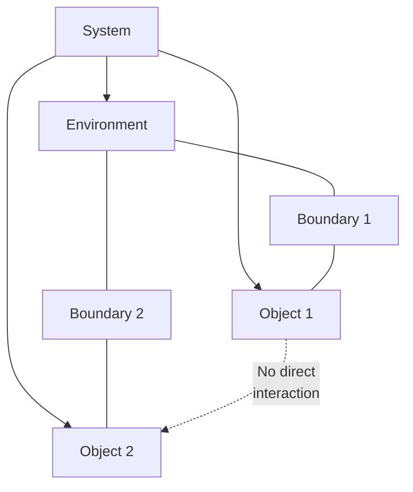
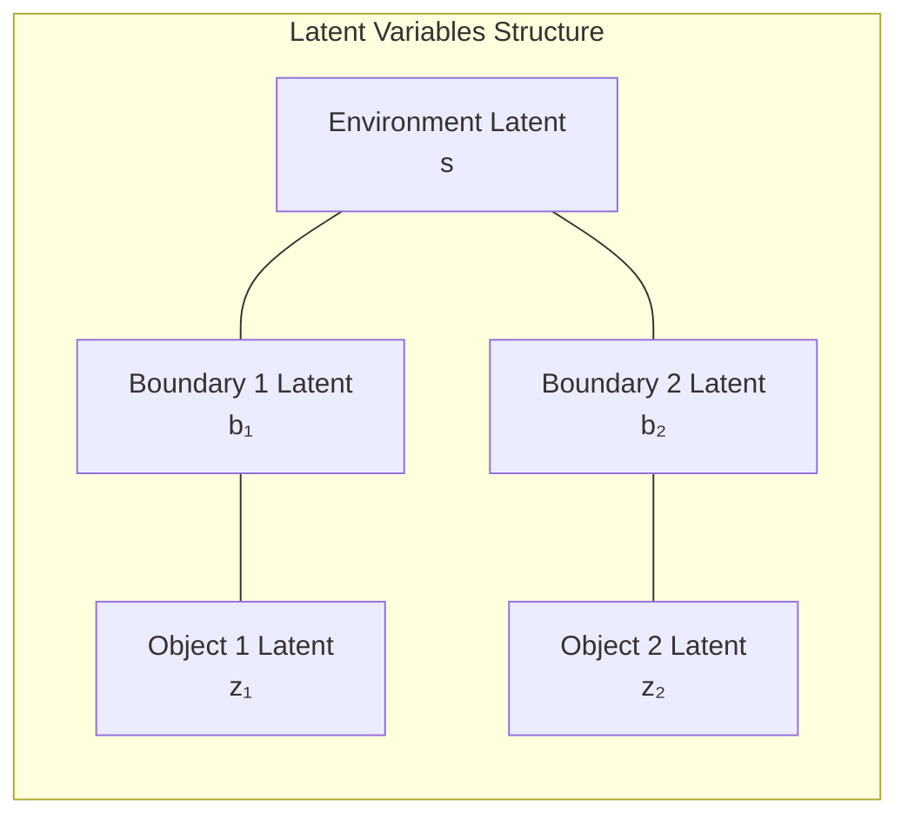

# Multiple Objects Detection with DMBD

This tutorial explains how to use DMBD to discover multiple objects within a system, rather than just a single object and its boundary.

## Multiple Objects Concept

In complex systems, there may be multiple distinct objects that interact with a shared environment. DMBD can be configured to identify these multiple objects and their respective boundaries.



In the multiple objects setting:
- All objects share a common environment
- Each object has its own boundary
- Objects do not directly interact with each other
- Each object interacts with the environment through its own boundary

## Configuring DMBD for Multiple Objects

Setting up DMBD to detect multiple objects requires a simple change in the constructor:

```python
# For a single object
model_single = DMBD(
    obs_shape=data.shape[-2:],
    role_dims=(4, 4, 4),
    hidden_dims=(3, 3, 3),
    number_of_objects=1  # Default
)

# For multiple objects (e.g., 2 objects)
model_multiple = DMBD(
    obs_shape=data.shape[-2:],
    role_dims=(4, 4, 4),
    hidden_dims=(3, 3, 3),
    number_of_objects=2  # Detect 2 objects
)
```

## How Multiple Objects Mode Works

When `number_of_objects > 1`, DMBD applies a different latent structure:



Specifically:
1. There is one shared environment latent with dimension `hidden_dims[0]`
2. Each object has its own boundary latent with dimension `hidden_dims[1]`
3. Each object has its own internal latent with dimension `hidden_dims[2]`

The total hidden dimension is: `hidden_dims[0] + number_of_objects * (hidden_dims[1] + hidden_dims[2])`

## Data Preparation

The data preparation is the same as for single object detection. The algorithm will automatically determine which observables belong to which object.

```python
# Shape remains (time_steps, batch_size, n_observables, observable_dimension)
data = torch.tensor(...).reshape(time_steps, batch_size, n_observables, observable_dimension)
```

## Training the Model

Training is also similar to the single object case:

```python
# Number of training iterations
training_iters = 20  # May need more iterations for multiple objects

# Train the model
for i in range(training_iters):
    elbo = model_multiple.update(
        data,           # Observable data
        None,           # No control inputs
        None,           # No regression covariates
        iters=2,        # Number of update iterations per call
        latent_iters=1, # Number of latent update iterations
        lr=0.5,         # Learning rate (may need to decrease for stability)
        verbose=True    # Show progress
    )
    
    print(f"Iteration {i+1}/{training_iters}, ELBO: {elbo:.4f}")
```

## Understanding Multiple Object Assignments

In multiple objects mode, the assignment values are different:

- **0**: Environment
- **1**: Boundary of Object 1
- **2**: Object 1
- **3**: Boundary of Object 2
- **4**: Object 2
- And so on...

```python
# Get assignments
assignments = model_multiple.assignment()

# Count how many observables are assigned to each category
assignment_counts = torch.bincount(assignments.flatten(), 
                                  minlength=1 + 2 * model_multiple.number_of_objects)

# Create labels for each assignment
labels = ['Environment']
for i in range(model_multiple.number_of_objects):
    labels.extend([f'Boundary {i+1}', f'Object {i+1}'])

# Print counts
for i, label in enumerate(labels):
    count = assignment_counts[i].item()
    percentage = 100 * count / assignments.numel()
    print(f"{label}: {count} ({percentage:.1f}%)")
```

## Visualizing Multiple Objects

### Static Visualization

```python
import matplotlib.pyplot as plt
import numpy as np
import matplotlib.cm as cm

# Choose a time point and batch to visualize
time_idx = -1  # Last time step
batch_idx = 0  # First batch

# Create a color map with distinct colors
n_assignments = 1 + 2 * model_multiple.number_of_objects
cmap = plt.cm.get_cmap('tab10', n_assignments)

# Assuming 2D spatial data
plt.figure(figsize=(12, 10))

# Plot each assignment type
for i in range(n_assignments):
    mask = (assignments[time_idx, batch_idx, :] == i)
    if mask.sum() > 0:
        plt.scatter(
            data[time_idx, batch_idx, mask, 0],  # x coordinate
            data[time_idx, batch_idx, mask, 1],  # y coordinate
            color=cmap(i),
            label=labels[i],
            s=100
        )

plt.xlabel('X Position')
plt.ylabel('Y Position')
plt.title('DMBD Multiple Objects Assignments')
plt.legend()
plt.grid(True)
plt.axis('equal')
plt.show()
```

### Dynamic Visualization

```python
from matplotlib.animation import FuncAnimation

# Create figure
fig, ax = plt.subplots(figsize=(12, 10))
ax.set_xlim(data[:, batch_idx, :, 0].min().item() - 0.5, 
           data[:, batch_idx, :, 0].max().item() + 0.5)
ax.set_ylim(data[:, batch_idx, :, 1].min().item() - 0.5, 
           data[:, batch_idx, :, 1].max().item() + 0.5)
ax.set_aspect('equal')
ax.grid(True)

# Create scatter plots for each assignment type
scatter_objs = []
for i in range(n_assignments):
    scatter = ax.scatter([], [], color=cmap(i), label=labels[i], s=100)
    scatter_objs.append(scatter)

ax.legend()

# Update function for animation
def update(frame):
    ax.set_title(f'Frame {frame}')
    
    for i in range(n_assignments):
        mask = (assignments[frame, batch_idx, :] == i)
        if mask.sum() > 0:
            pos = np.column_stack([
                data[frame, batch_idx, mask, 0].numpy(),
                data[frame, batch_idx, mask, 1].numpy()
            ])
            scatter_objs[i].set_offsets(pos)
        else:
            scatter_objs[i].set_offsets(np.empty((0, 2)))
    
    return scatter_objs

# Create animation
anim = FuncAnimation(fig, update, frames=len(data), interval=100, blit=True)

# Save animation
anim.save('dmbd_multiple_objects_animation.mp4', writer='ffmpeg', fps=10)
```

## Analyzing Individual Objects

To analyze each object separately:

```python
# Extract environment, boundaries, and objects
env_mask = (assignments == 0)
obj_masks = []
boundary_masks = []

for i in range(model_multiple.number_of_objects):
    boundary_idx = 1 + 2*i
    object_idx = boundary_idx + 1
    
    boundary_masks.append(assignments == boundary_idx)
    obj_masks.append(assignments == object_idx)

# Now you can analyze each object separately
for obj_idx, (obj_mask, boundary_mask) in enumerate(zip(obj_masks, boundary_masks)):
    print(f"\nObject {obj_idx+1} Analysis:")
    
    # Calculate percentage of time steps where this object exists
    obj_exists = obj_mask.any(dim=2).float().mean().item() * 100
    print(f"  Exists in {obj_exists:.1f}% of time steps")
    
    # Calculate average size (number of observables) of this object
    obj_size = obj_mask.float().sum(dim=2).mean().item()
    print(f"  Average size: {obj_size:.1f} observables")
    
    # Calculate average size of boundary
    boundary_size = boundary_mask.float().sum(dim=2).mean().item()
    print(f"  Average boundary size: {boundary_size:.1f} observables")
```

## Accessing Object-Specific Latent States

```python
# Get the latent states
latent_states = model_multiple.px.mean()  # Shape: (time_steps, batch_size, hidden_dim)

# Extract components
s_dim = model_multiple.hidden_dims[0]
b_dim = model_multiple.hidden_dims[1]
z_dim = model_multiple.hidden_dims[2]

# Environment latent is always at the beginning
env_latent = latent_states[:, batch_idx, :s_dim]

# For each object, extract its boundary and internal latent
for obj_idx in range(model_multiple.number_of_objects):
    # Calculate indices for this object's latents
    b_start = s_dim + obj_idx * (b_dim + z_dim)
    b_end = b_start + b_dim
    z_start = b_end
    z_end = z_start + z_dim
    
    # Extract latents
    boundary_latent = latent_states[:, batch_idx, b_start:b_end]
    object_latent = latent_states[:, batch_idx, z_start:z_end]
    
    # Print first dimension of each as an example
    print(f"\nObject {obj_idx+1} Latents (first dimension):")
    print(f"  Boundary: {boundary_latent[0, 0].item():.4f}")
    print(f"  Object: {object_latent[0, 0].item():.4f}")
```

## Visualizing Object Interactions

To understand how objects interact through their shared environment:

```python
# Plot the first dimension of environment and object latents
plt.figure(figsize=(14, 8))

# Environment
plt.plot(env_latent[:, 0], 'k-', linewidth=2, label='Environment')

# Objects
for obj_idx in range(model_multiple.number_of_objects):
    # Calculate indices for this object's latents
    b_start = s_dim + obj_idx * (b_dim + z_dim)
    b_end = b_start + b_dim
    z_start = b_end
    z_end = z_start + z_dim
    
    # Extract latents
    boundary_latent = latent_states[:, batch_idx, b_start:b_end]
    object_latent = latent_states[:, batch_idx, z_start:z_end]
    
    plt.plot(boundary_latent[:, 0], '--', linewidth=1.5, 
             label=f'Boundary {obj_idx+1}')
    plt.plot(object_latent[:, 0], '-', linewidth=1.5, 
             label=f'Object {obj_idx+1}')

plt.xlabel('Time Step')
plt.ylabel('Latent Value')
plt.title('Latent Dynamics of Multiple Objects')
plt.legend()
plt.grid(True)
plt.show()
```

## How Many Objects to Use?

Deciding on the number of objects is a model selection problem. There are several approaches:

1. **Domain knowledge**: Use your understanding of the system
2. **ELBO comparison**: Train models with different numbers of objects and compare ELBO values
3. **Assignment stability**: Check if assignments are stable and interpretable

```python
# Train models with different numbers of objects
results = {}
for num_objects in range(1, 5):
    model = DMBD(
        obs_shape=data.shape[-2:],
        role_dims=(4, 4, 4),
        hidden_dims=(3, 3, 3),
        number_of_objects=num_objects
    )
    
    # Train model
    print(f"\nTraining model with {num_objects} objects...")
    for i in range(10):
        elbo = model.update(data, None, None, iters=2, latent_iters=1, lr=0.5)
    
    # Get final ELBO and assignments
    final_elbo = model.ELBO().item()
    assignments = model.assignment()
    
    # Store results
    results[num_objects] = {
        'elbo': final_elbo,
        'model': model,
        'assignments': assignments
    }
    
    print(f"Model with {num_objects} objects - Final ELBO: {final_elbo:.4f}")

# Plot ELBO comparison
plt.figure(figsize=(10, 6))
plt.plot(results.keys(), [r['elbo'] for r in results.values()], 'o-', linewidth=2)
plt.xlabel('Number of Objects')
plt.ylabel('ELBO')
plt.title('Model Comparison by Number of Objects')
plt.grid(True)
plt.xticks(list(results.keys()))
plt.show()
```

## Tips for Multiple Object Detection

1. **Initialization**: Multiple object detection can be sensitive to initialization. Try running the model multiple times with different random seeds.

2. **Parameter Tuning**: You may need to adjust:
   - `hidden_dims`: More complex systems may need larger hidden dimensions
   - `role_dims`: More roles can help capture complex object behaviors
   - Learning rate: Try a lower learning rate for stability

3. **Convergence**: Multiple object detection may require more iterations to converge.

4. **Interpretability**: Look for coherent patterns in assignments. Objects should form spatially or temporally coherent groups.

5. **Object Identifiability**: Note that the model may swap object identities between runs. Object 1 in one run might be equivalent to Object 2 in another run.

## Common Issues

### All Components Assigned to One Object

If most components are assigned to one object with other objects nearly empty:
- Try adjusting `role_dims` and `hidden_dims` to be larger
- Use a lower learning rate
- Try different initializations

### Unstable Assignments

If assignments fluctuate wildly during training:
- Use a lower learning rate
- Increase `latent_iters` for more stable latent updates
- Consider fewer objects

### Similar or Redundant Objects

If multiple objects have very similar patterns:
- The system might be better modeled with fewer objects
- Try models with different numbers of objects and compare ELBO

## Next Steps

- [Parameter Tuning](parameter_tuning.md): Learn how to tune DMBD parameters for optimal results
- [Custom Data](custom_data.md): Apply multiple object discovery to your own datasets
- [Advanced Analysis](advanced_analysis.md): More sophisticated analysis techniques for multiple object systems 