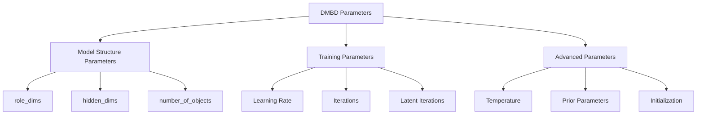

# Parameter Tuning for DMBD

This guide provides detailed advice on how to tune the parameters of a Dynamic Markov Blanket Detection (DMBD) model to achieve optimal results for your specific application.

## Parameter Overview

DMBD has several important parameters that affect model performance:



## Model Structure Parameters

### `role_dims`: Role Dimensions

This parameter controls the number of different roles that each component (environment, boundary, object) can play.

```python
role_dims = (s_roles, b_roles, z_roles)
```

Where:
- `s_roles`: Number of environment roles
- `b_roles`: Number of boundary roles
- `z_roles`: Number of object roles

**Guidelines**:
- Start with equal values, e.g., `(4, 4, 4)`
- For complex, nonlinear systems, increase all values
- For highly interpretable results, use fewer roles, e.g., `(2, 2, 2)`
- If one component seems more complex, increase its role count

**Effects of increasing**:
- More flexible model that can capture more complex patterns
- Better fit to nonlinear dynamics
- Potentially slower convergence
- Risk of overfitting on small datasets

**Effects of decreasing**:
- More interpretable results
- Faster convergence
- May miss complex patterns
- Potentially worse fit

**Tuning strategy**:
1. Start with moderate values like `(4, 4, 4)`
2. If assignments look too random or ELBO is low, increase roles
3. If model is slow or results are hard to interpret, decrease roles

### `hidden_dims`: Latent Dimensions

Controls the dimensionality of the latent space for each component:

```python
hidden_dims = (s_dim, b_dim, z_dim)
```

Where:
- `s_dim`: Environment latent dimension
- `b_dim`: Boundary latent dimension
- `z_dim`: Object latent dimension

**Guidelines**:
- Start with equal dimensions, e.g., `(3, 3, 3)`
- For complex systems, increase dimensions
- Dimensions should typically be less than or equal to the observable dimension
- Environment dimensions might need to be larger if it's more complex

**Effects of increasing**:
- More expressive latent representation
- Better modeling of complex dynamics
- Higher computational cost
- Risk of learning spurious patterns

**Effects of decreasing**:
- More interpretable latents
- Faster training
- Forces the model to learn simpler patterns
- May underfit complex dynamics

**Tuning strategy**:
1. Start with moderate dimensions like `(3, 3, 3)`
2. If model struggles to fit data, increase dimensions
3. If model converges very slowly, try reducing dimensions
4. For very complex environments, try increasing `s_dim` relative to others

### `number_of_objects`: Number of Objects

Controls how many distinct objects the model will try to discover:

```python
number_of_objects = n  # Default is 1
```

**Guidelines**:
- Start with 1 unless you have strong prior knowledge
- For complex systems, try models with different numbers of objects
- Compare ELBO values across models to select the best number

**Effects of increasing**:
- Can discover multiple distinct objects
- More expressive model for complex systems
- Higher computational cost
- May learn redundant objects if too high

**Effects of decreasing**:
- Simpler, more interpretable model
- Faster training
- May miss distinct objects if too low

**Tuning strategy**:
1. Start with `number_of_objects=1`
2. Train multiple models with increasing values 
3. Compare ELBO values and object assignments
4. Select the model with highest ELBO and meaningful object assignments

## Training Parameters

### Learning Rate

Controls how quickly the model updates its parameters:

```python
lr = 0.5  # Default value
```

**Guidelines**:
- Start with `lr=0.5` for simple problems
- Use `lr=0.1` or lower for complex systems or if training is unstable
- For multiple objects, consider using a lower learning rate

**Effects of increasing**:
- Faster learning
- Potentially faster convergence
- Risk of instability or oscillation

**Effects of decreasing**:
- More stable training
- Potentially better final results
- Slower convergence, requiring more iterations

**Tuning strategy**:
1. Start with `lr=0.5`
2. If assignments fluctuate wildly, reduce learning rate
3. If convergence is very slow, consider increasing learning rate
4. For fine-tuning, gradually decrease learning rate over training

### Iterations and Latent Iterations

Control how many update steps to perform:

```python
iters = 5  # Number of overall iterations
latent_iters = 1  # Number of latent update iterations per parameter update
```

**Guidelines**:
- Start with `iters=5`, `latent_iters=1`
- For complex systems, increase both
- Multiple objects may require more iterations

**Effects of increasing**:
- Better convergence
- Potentially better final model
- Longer training time

**Effects of decreasing**:
- Faster training
- May not fully converge
- Useful for quick experimentation

**Tuning strategy**:
1. Start with moderate values like `iters=5`, `latent_iters=1`
2. Monitor ELBO during training to see if it's still improving
3. If ELBO plateaus early, you might reduce iterations
4. If ELBO is still improving at the end, increase iterations
5. For unstable training, try increasing `latent_iters` to 2 or 3

## Advanced Parameters

### Temperature for Role Assignments

Controls how sharp or soft the role assignments are:

```python
model.obs_model.ptemp = 1.0  # Default value
```

**Guidelines**:
- Higher values (e.g., 3.0-10.0) give sharper assignments
- Lower values (e.g., 0.5-1.0) give softer, more uncertain assignments

**Effects of increasing**:
- More confident, discrete assignments
- Clearer separation between roles
- May stabilize training for clear patterns

**Effects of decreasing**:
- More uncertain, probabilistic assignments
- Better reflection of assignment uncertainty
- May help prevent getting stuck in local optima

**Tuning strategy**:
1. Start with the default temperature
2. If assignments seem too uncertain, increase temperature
3. If assignments seem too rigid or training gets stuck, decrease temperature
4. For visualization, use higher temperature for clearer results

### Custom Initialization

You can initialize the model with custom values:

```python
# Initialize model
model = DMBD(
    obs_shape=data.shape[-2:],
    role_dims=(4, 4, 4),
    hidden_dims=(3, 3, 3)
)

# Set custom initial values for latent states
initial_latent = torch.randn(time_steps, batch_size, model.hidden_dim)
model.px.loc = initial_latent

# Set custom initial temperature
model.obs_model.ptemp = 5.0
```

**When to use custom initialization**:
- When you have prior knowledge about the system
- If standard initialization consistently converges to poor solutions
- When comparing different models and want to control for initialization effects

## Parameter Selection for Different Problems

### Simple Systems (e.g., pendulum, simple oscillators)

```python
model = DMBD(
    obs_shape=data.shape[-2:],
    role_dims=(2, 2, 2),  # Few roles
    hidden_dims=(2, 2, 2),  # Small latent space
    number_of_objects=1
)

# Training
for i in range(10):
    model.update(data, None, None, iters=2, latent_iters=1, lr=0.5)
```

### Complex Systems (e.g., flocking, cellular automata)

```python
model = DMBD(
    obs_shape=data.shape[-2:],
    role_dims=(8, 8, 8),  # Many roles for complex patterns
    hidden_dims=(6, 6, 6),  # Larger latent space
    number_of_objects=2  # Try multiple objects
)

# Set temperature for sharper assignments
model.obs_model.ptemp = 5.0

# Training with more iterations and lower learning rate
for i in range(20):
    model.update(data, None, None, iters=3, latent_iters=2, lr=0.2)
```

### Noisy Data

```python
model = DMBD(
    obs_shape=data.shape[-2:],
    role_dims=(6, 6, 6),  # More roles to capture noisy patterns
    hidden_dims=(4, 4, 4),  # Moderate latent space
    number_of_objects=1
)

# Lower temperature for softer assignments
model.obs_model.ptemp = 1.0

# Careful training with low learning rate
for i in range(15):
    model.update(data, None, None, iters=3, latent_iters=2, lr=0.1)
```

## Systematic Parameter Tuning

For methodical tuning, use a grid search approach:

```python
import itertools
import numpy as np

# Define parameter grids
role_dims_grid = [(2, 2, 2), (4, 4, 4), (6, 6, 6)]
hidden_dims_grid = [(2, 2, 2), (3, 3, 3), (4, 4, 4)]
lr_grid = [0.1, 0.3, 0.5]

# Track results
results = []

# Grid search
for role_dims, hidden_dims, lr in itertools.product(role_dims_grid, hidden_dims_grid, lr_grid):
    print(f"Testing parameters: role_dims={role_dims}, hidden_dims={hidden_dims}, lr={lr}")
    
    # Initialize model
    model = DMBD(
        obs_shape=data.shape[-2:],
        role_dims=role_dims,
        hidden_dims=hidden_dims
    )
    
    # Train model
    for i in range(10):
        elbo = model.update(data, None, None, iters=2, latent_iters=1, lr=lr)
    
    # Record results
    results.append({
        'role_dims': role_dims,
        'hidden_dims': hidden_dims,
        'lr': lr,
        'elbo': model.ELBO().item(),
        'model': model
    })

# Find best model
best_result = max(results, key=lambda x: x['elbo'])
print(f"Best parameters: role_dims={best_result['role_dims']}, "
      f"hidden_dims={best_result['hidden_dims']}, lr={best_result['lr']}")
print(f"Best ELBO: {best_result['elbo']:.4f}")
```

## Visualizing Parameter Effects

To understand how parameters affect results:

```python
import matplotlib.pyplot as plt
import pandas as pd

# Convert results to DataFrame
df = pd.DataFrame([(r['role_dims'][0], r['hidden_dims'][0], r['lr'], r['elbo']) 
                   for r in results],
                  columns=['roles', 'hidden', 'lr', 'elbo'])

# Group by different parameters
roles_effect = df.groupby('roles')['elbo'].mean().reset_index()
hidden_effect = df.groupby('hidden')['elbo'].mean().reset_index()
lr_effect = df.groupby('lr')['elbo'].mean().reset_index()

# Plot effects
fig, (ax1, ax2, ax3) = plt.subplots(1, 3, figsize=(15, 5))

ax1.bar(roles_effect['roles'], roles_effect['elbo'])
ax1.set_xlabel('Number of Roles')
ax1.set_ylabel('Average ELBO')
ax1.set_title('Effect of Role Dimensions')

ax2.bar(hidden_effect['hidden'], hidden_effect['elbo'])
ax2.set_xlabel('Hidden Dimensions')
ax2.set_title('Effect of Hidden Dimensions')

ax3.bar(lr_effect['lr'], lr_effect['elbo'])
ax3.set_xlabel('Learning Rate')
ax3.set_title('Effect of Learning Rate')

plt.tight_layout()
plt.show()
```

## Strategies for Specific Issues

### Model Doesn't Converge

1. Reduce learning rate (`lr=0.1` or lower)
2. Increase latent iterations (`latent_iters=2` or `3`)
3. Try different initializations
4. Normalize data more carefully
5. Reduce the model complexity (fewer roles and hidden dimensions)

### All Assigned to One Component

1. Adjust temperature (`model.obs_model.ptemp = 3.0` or higher)
2. Increase roles and hidden dimensions
3. Reduce learning rate
4. Normalize data to have similar scales across observables
5. Try different initializations

### Training Too Slow

1. Reduce roles and hidden dimensions
2. Increase learning rate (if stable)
3. Reduce latent iterations to 1
4. Use fewer iterations if ELBO plateaus early
5. Consider using a smaller subset of data for initial experiments

### Random-Looking Assignments

1. Increase temperature for sharper assignments
2. Ensure data is properly normalized
3. Try more training iterations
4. Increase roles and hidden dimensions
5. Reduce learning rate for more stable training

## Final Recommendations

1. **Start Simple**: Begin with a simple model and gradually increase complexity
2. **Monitor ELBO**: Track the ELBO during training to guide parameter adjustments
3. **Visualize Regularly**: Check assignments frequently during tuning
4. **Be Patient**: Complex systems may require many iterations to converge
5. **Try Multiple Initializations**: Results can be sensitive to initialization
6. **Domain Knowledge**: Use your understanding of the system to guide parameter selection

Remember that DMBD is trying to discover structure in your data. If your data genuinely doesn't have Markov blanket structure, the model may not find meaningful assignments regardless of parameter settings. 