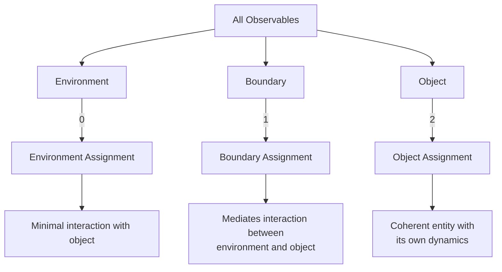

# Understanding DMBD Results

This tutorial explains how to interpret the results from a Dynamic Markov Blanket Detection (DMBD) model and visualize them effectively.

## DMBD Output Overview

After training a DMBD model, you'll primarily be interested in:

1. **Assignments**: Which microscopic components belong to environment, boundary, or object
2. **Latent Dynamics**: The discovered hidden dynamics governing the system
3. **Model Quality**: How well the model explains your data

## Assignment Analysis

### Basic Assignment Structure



### Getting Assignments

```python
# Get assignment probabilities
assignment_probs = model.assignment_pr()  # Soft assignments
assignments = model.assignment()  # Hard assignments (0=env, 1=boundary, 2=object)

# Shape of assignments: (time_steps, batch_size, n_observables)
print(f"Assignment shape: {assignments.shape}")
```

### Visualizing Assignments

#### Static Visualization

```python
import matplotlib.pyplot as plt
import numpy as np

# Choose a time point and batch to visualize
time_idx = -1  # Last time step
batch_idx = 0  # First batch

# Create a color map
colors = ['blue', 'green', 'red']  # Environment, Boundary, Object
labels = ['Environment', 'Boundary', 'Object']

# Assuming 2D spatial data in the first two dimensions of observables
plt.figure(figsize=(10, 8))

# Plot each assignment type
for i in range(3):
    mask = (assignments[time_idx, batch_idx, :] == i)
    if mask.sum() > 0:
        plt.scatter(
            data[time_idx, batch_idx, mask, 0],  # x coordinate
            data[time_idx, batch_idx, mask, 1],  # y coordinate
            color=colors[i],
            label=labels[i],
            s=100
        )

plt.xlabel('X Position')
plt.ylabel('Y Position')
plt.title('DMBD Assignments')
plt.legend()
plt.grid(True)
plt.axis('equal')
plt.show()
```

#### Dynamic Visualization (Animation)

```python
from matplotlib.animation import FuncAnimation

# Create figure
fig, ax = plt.subplots(figsize=(10, 8))
ax.set_xlim(data[:, batch_idx, :, 0].min().item() - 0.5, 
           data[:, batch_idx, :, 0].max().item() + 0.5)
ax.set_ylim(data[:, batch_idx, :, 1].min().item() - 0.5, 
           data[:, batch_idx, :, 1].max().item() + 0.5)
ax.set_aspect('equal')
ax.grid(True)

# Create scatter plots for each assignment type
scatter_objs = []
for i in range(3):
    scatter = ax.scatter([], [], color=colors[i], label=labels[i], s=100)
    scatter_objs.append(scatter)

ax.legend()

# Update function for animation
def update(frame):
    ax.set_title(f'Frame {frame}')
    
    for i in range(3):
        mask = (assignments[frame, batch_idx, :] == i)
        if mask.sum() > 0:
            pos = np.column_stack([
                data[frame, batch_idx, mask, 0].numpy(),
                data[frame, batch_idx, mask, 1].numpy()
            ])
            scatter_objs[i].set_offsets(pos)
        else:
            scatter_objs[i].set_offsets(np.empty((0, 2)))
    
    return scatter_objs

# Create animation
anim = FuncAnimation(fig, update, frames=len(data), interval=100, blit=True)

# Save animation
anim.save('dmbd_assignment_animation.mp4', writer='ffmpeg', fps=10)
```

### Assignment Statistics

Analyzing how assignments change over time or across batches:

```python
# Calculate percentage of each assignment type
env_percent = (assignments == 0).float().mean().item() * 100
bound_percent = (assignments == 1).float().mean().item() * 100
obj_percent = (assignments == 2).float().mean().item() * 100

print(f"Environment: {env_percent:.1f}%")
print(f"Boundary: {bound_percent:.1f}%")
print(f"Object: {obj_percent:.1f}%")

# Track assignment changes over time
assignment_changes = (assignments[1:] != assignments[:-1]).float().mean(dim=(1, 2))
plt.figure(figsize=(10, 6))
plt.plot(range(1, len(assignment_changes) + 1), assignment_changes)
plt.xlabel('Time Step')
plt.ylabel('Fraction of Changed Assignments')
plt.title('Assignment Stability Over Time')
plt.grid(True)
plt.show()
```

## Analyzing Latent Dynamics

The discovered latent variables (s, b, z) represent the dynamics of the environment, boundary, and object respectively.

### Visualizing Latent States

```python
# Get the latent states
latent_states = model.px.mean()  # Shape: (time_steps, batch_size, hidden_dim)

# Extract environment, boundary, and object components
h1 = model.hidden_dims[0]
h2 = h1 + model.hidden_dims[1]
h3 = h2 + model.hidden_dims[2]

env_states = latent_states[:, batch_idx, :h1]
bound_states = latent_states[:, batch_idx, h1:h2]
obj_states = latent_states[:, batch_idx, h2:h3]

# Plot the first dimension of each component over time
plt.figure(figsize=(12, 8))
plt.plot(env_states[:, 0], label='Environment')
plt.plot(bound_states[:, 0], label='Boundary')
plt.plot(obj_states[:, 0], label='Object')
plt.xlabel('Time Step')
plt.ylabel('Latent Value')
plt.title('First Latent Dimension Over Time')
plt.legend()
plt.grid(True)
plt.show()
```

### Visualizing Transition Matrices

The transition matrix A reveals how latent states influence each other:

```python
# Get the transition matrix
A = model.pAB.mean()[:model.hidden_dim, :model.hidden_dim]

# Visualize with a heatmap
plt.figure(figsize=(10, 8))
plt.imshow(A.detach().numpy(), cmap='coolwarm', vmin=-1, vmax=1)
plt.colorbar(label='Coefficient Value')

# Add labels for s, b, z regions
h1 = model.hidden_dims[0]
h2 = h1 + model.hidden_dims[1]
h3 = h2 + model.hidden_dims[2]

# Add dividing lines
plt.axhline(y=h1-0.5, color='black', linestyle='-', alpha=0.5)
plt.axhline(y=h2-0.5, color='black', linestyle='-', alpha=0.5)
plt.axvline(x=h1-0.5, color='black', linestyle='-', alpha=0.5)
plt.axvline(x=h2-0.5, color='black', linestyle='-', alpha=0.5)

# Add labels
plt.text(h1/2, -1, 's', ha='center', va='center', fontsize=14)
plt.text(h1 + model.hidden_dims[1]/2, -1, 'b', ha='center', va='center', fontsize=14)
plt.text(h2 + model.hidden_dims[2]/2, -1, 'z', ha='center', va='center', fontsize=14)

plt.text(-1, h1/2, 's', ha='center', va='center', fontsize=14)
plt.text(-1, h1 + model.hidden_dims[1]/2, 'b', ha='center', va='center', fontsize=14)
plt.text(-1, h2 + model.hidden_dims[2]/2, 'z', ha='center', va='center', fontsize=14)

plt.title('Transition Matrix A')
plt.tight_layout()
plt.show()
```

## Evaluation Metrics

### Evidence Lower Bound (ELBO)

The ELBO indicates how well the model fits the data:

```python
# Calculate ELBO
elbo = model.ELBO()
print(f"ELBO: {elbo:.4f}")

# If you've been tracking ELBO during training
plt.figure(figsize=(10, 6))
plt.plot(elbo_history)
plt.xlabel('Iteration')
plt.ylabel('ELBO')
plt.title('Training Progress')
plt.grid(True)
plt.show()
```

### Role Analysis

DMBD uses roles to capture non-linear relationships. Examining role assignments can provide insights:

```python
# Get particular role assignments
role_probs = model.particular_assignment_pr()  # Probabilities
role_assignments = model.particular_assignment()  # Hard assignments

# Count frequency of each role
role_counts = torch.bincount(role_assignments.flatten(), 
                            minlength=model.role_dim)
role_percentages = role_counts.float() / role_counts.sum()

# Plot role distribution
plt.figure(figsize=(12, 6))
plt.bar(range(model.role_dim), role_percentages)

# Add vertical lines separating role types
r1 = model.role_dims[0]
r2 = r1 + model.role_dims[1]
plt.axvline(x=r1-0.5, color='black', linestyle='--', alpha=0.7)
plt.axvline(x=r2-0.5, color='black', linestyle='--', alpha=0.7)

plt.xticks(range(model.role_dim))
plt.xlabel('Role Index')
plt.ylabel('Percentage of Assignments')
plt.title('Role Distribution')

# Add labels for role types
plt.text(model.role_dims[0]/2, max(role_percentages.numpy())*0.9, 'Environment Roles', 
         ha='center', va='center', bbox=dict(facecolor='white', alpha=0.7))
plt.text(r1 + model.role_dims[1]/2, max(role_percentages.numpy())*0.9, 'Boundary Roles', 
         ha='center', va='center', bbox=dict(facecolor='white', alpha=0.7))
plt.text(r2 + model.role_dims[2]/2, max(role_percentages.numpy())*0.9, 'Object Roles', 
         ha='center', va='center', bbox=dict(facecolor='white', alpha=0.7))

plt.grid(True, axis='y')
plt.show()
```

## Multiple Objects Analysis

If you're using DMBD with `number_of_objects > 1`, you need a slightly different approach:

```python
# For multiple objects, assignments work differently
# Each observable is assigned to one of:
# - Environment (0)
# - Boundary of Object 1 (1)
# - Object 1 (2)
# - Boundary of Object 2 (3)
# - Object 2 (4)
# And so on...

# Visualize with a different color for each assignment
if model.number_of_objects > 1:
    # Create color map with distinct colors for each assignment
    import matplotlib.cm as cm
    n_assignments = 1 + 2 * model.number_of_objects  # 1 env + (1 bound + 1 obj) per object
    cmap = plt.cm.get_cmap('tab10', n_assignments)
    
    # Create labels
    labels = ['Environment']
    for i in range(model.number_of_objects):
        labels.extend([f'Boundary {i+1}', f'Object {i+1}'])
    
    # Visualization code similar to before but with the expanded color map
    plt.figure(figsize=(10, 8))
    for i in range(n_assignments):
        mask = (assignments[time_idx, batch_idx, :] == i)
        if mask.sum() > 0:
            plt.scatter(
                data[time_idx, batch_idx, mask, 0],
                data[time_idx, batch_idx, mask, 1],
                color=cmap(i),
                label=labels[i],
                s=100
            )
    
    plt.xlabel('X Position')
    plt.ylabel('Y Position')
    plt.title('Multiple Objects DMBD Assignments')
    plt.legend()
    plt.grid(True)
    plt.axis('equal')
    plt.show()
```

## Comparing Models

When trying different DMBD parameters, it's useful to compare results:

```python
# Compare ELBO values
models = {
    "Small": {"elbo": elbo_small, "assignments": assignments_small},
    "Medium": {"elbo": elbo_medium, "assignments": assignments_medium},
    "Large": {"elbo": elbo_large, "assignments": assignments_large},
}

# Bar chart of ELBO values
plt.figure(figsize=(8, 6))
plt.bar(models.keys(), [model_data["elbo"] for model_data in models.values()])
plt.xlabel('Model Size')
plt.ylabel('ELBO')
plt.title('Model Comparison by ELBO')
plt.grid(True, axis='y')
plt.show()

# Compute assignment consistency
reference_model = "Medium"
reference_assignments = models[reference_model]["assignments"]

consistency = {}
for name, model_data in models.items():
    if name != reference_model:
        consistency[name] = (model_data["assignments"] == reference_assignments).float().mean().item() * 100

print(f"Assignment consistency with {reference_model} model:")
for name, value in consistency.items():
    print(f"  {name}: {value:.1f}%")
```

## Saving and Loading Results

To save your analysis for future reference:

```python
import torch
import pickle
import os

# Create a results directory if it doesn't exist
os.makedirs("dmbd_results", exist_ok=True)

# Save the model
torch.save(model.state_dict(), "dmbd_results/model.pt")

# Save assignments
torch.save(assignments, "dmbd_results/assignments.pt")
torch.save(assignment_probs, "dmbd_results/assignment_probs.pt")

# Save figures
plt.figure(figsize=(10, 8))
# ... (create your visualization)
plt.savefig("dmbd_results/assignments_visualization.png", dpi=300)

# Save metadata and parameters
metadata = {
    "data_shape": tuple(data.shape),
    "role_dims": model.role_dims,
    "hidden_dims": model.hidden_dims,
    "number_of_objects": model.number_of_objects,
    "elbo": model.ELBO().item(),
    "timestamp": time.strftime("%Y-%m-%d %H:%M:%S"),
}

with open("dmbd_results/metadata.pkl", "wb") as f:
    pickle.dump(metadata, f)
```

## Tips for Interpreting Results

### Environment, Boundary, Object Interpretation

- **Environment (s)**: Components that influence but are separate from the object
- **Boundary (b)**: Interface between object and environment; mediates interactions
- **Object (z)**: Components that form a coherent entity with its own dynamics

### Assignment Stability

Stable assignments (not changing frequently over time) generally indicate good model fit, except in cases where components naturally transition between roles (e.g., matter exchange).

### Non-convergence Signs

If your results show these issues, consider adjusting parameters:

1. **All to one assignment**: Everything assigned to environment or object
2. **Random fluctuation**: Assignments changing rapidly and randomly
3. **No clear pattern**: Spatial assignments appear random with no coherent structure

## Next Steps

- [Parameter Tuning](parameter_tuning.md): Adjust model parameters for better results
- [Multiple Objects Detection](multiple_objects.md): Discover multiple objects in your data
- [Working with Custom Data](custom_data.md): Adapt DMBD for your specific data types 