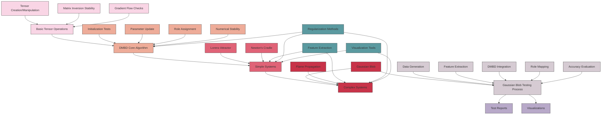

# Dynamic Markov Blanket Detection (DMBD) Test Suite

This document provides a comprehensive overview of the DMBD test suite, focusing on the process flow from basic tensor operations to complex Markov Blanket detection in simulated environments like the Gaussian Blob.

## Test Framework Overview

The DMBD test framework is designed with a progressive validation approach:

1. **Basic Tensor Operations**: Validates fundamental PyTorch operations required by DMBD
2. **Core DMBD Functionality**: Tests the essential algorithms and numerical stability
3. **Simple System Integration**: Tests with simple, controlled dynamical systems
4. **Complex System Integration**: Tests with more complex systems like the Gaussian Blob

## Test Process Diagram

The following diagram illustrates the test process flow and dependencies:



## Test Categories

### 1. Basic Tensor Operations Tests (`test_dmbd_dimensions.py`)

These tests validate the fundamental tensor operations that DMBD relies on:

- **Tensor Dimensions**: Tests proper sizing and dimensionality
- **Broadcasting**: Tests correct tensor broadcasting
- **Matrix Inversion**: Tests stable matrix inversion techniques
- **Gradient Flow**: Tests backpropagation through all operations

```bash
python -m fork.tests.test_dmbd_dimensions --focus=basic
```

### 2. DMBD Core Algorithm Tests (`test_dmbd_basic.py`)

These tests validate the core DMBD algorithm:

- **Initialization**: Tests model parameter creation
- **Parameter Updates**: Tests the update functions
- **Role Assignment**: Tests functional role assignment algorithms
- **Convergence**: Tests iterative convergence behavior

```bash
python -m fork.tests.test_dmbd_basic
```

### 3. Numerical Stability Tests (`test_dmbd_numerical_stability.py`)

These tests focus on numerical stability issues:

- **Matrix Conditioning**: Tests techniques to handle ill-conditioned matrices
- **Regularization**: Tests different regularization approaches
- **SVD-based Inversions**: Tests singular value decomposition approaches 
- **Extreme Cases**: Tests performance on numerically challenging inputs

```bash
python -m fork.tests.test_dmbd_numerical_stability
```

### 4. System-Specific Tests

The test suite includes several system-specific tests:

| System | Description | File |
|--------|-------------|------|
| Lorenz Attractor | Chaotic dynamical system with 3 variables | `test_lorenz_dmbd.py` |
| Cart with Pendulums | Mechanical system with a cart and two pendulums | `test_cartthingy_dmbd.py` |
| Flame Propagation | Reaction-diffusion system modeling flame spread | `test_flame_dmbd.py` |
| Forager Agent | Agent-based model of a foraging entity | `test_forager_dmbd.py` |
| Newton's Cradle | Physical system with energy transfer | `test_newtons_cradle_dmbd.py` |
| Gaussian Blob | Moving Gaussian activation pattern on a 2D grid | `test_dmbd_gaussian_blob_integration.py` |

### 5. Gaussian Blob Integration Tests (`test_dmbd_gaussian_blob_integration.py`)

These tests validate DMBD on the Gaussian Blob simulation:

- **Feature Extraction**: Tests different methods for extracting features
- **Integration**: Tests the full integration between DMBD and simulation
- **Role Assignment Accuracy**: Tests accuracy compared to ground truth
- **Visualization**: Tests visualization capabilities

```bash
python -m fork.tests.test_dmbd_gaussian_blob_integration
```

## Running the Complete Test Suite

To run the entire test suite with optimized settings:

```bash
python -m fork.tests.run_dmbd_tests
```

### Command Line Options

```bash
python -m fork.tests.run_dmbd_tests [options]
```

Options:
- `--quick`: Run with reduced iterations for faster testing
- `--seed N`: Set random seed for reproducibility 
- `--timeout N`: Set timeout per test in seconds
- `--memory-limit N`: Set memory limit in MB
- `--test-pattern PATTERN`: Run only tests matching pattern
- `--system SYSTEM`: Run tests only for the specified system
- `--verbose`: Enable detailed output during test runs
- `--save-plots`: Save additional visualization plots
- `--iterations N`: Set the number of DMBD training iterations (default: 10)

### Quick Mode

For faster testing with reduced settings:

```bash
python -m fork.tests.run_dmbd_tests --quick
```

This will:
- Use smaller simulation sizes
- Run fewer DMBD training iterations
- Test fewer hyperparameter configurations

## Understanding Test Results

Test results are organized in the output directory (default: `dmbd_outputs/`):

```
dmbd_outputs/
├── test_name/                 # Each test gets its own directory
│   ├── visualizations/        # Visual outputs
│   │   ├── ...
│   ├── test_name_log.txt      # Detailed test log
│   └── metrics.json           # Performance metrics
└── dmbd_test_summary.txt      # Overall test summary
```

### Key Metrics Tracked

- Tensor dimensions and shapes throughout the pipeline
- Matrix inversion stability with different regularization
- Role assignment accuracy compared to ground truth
- Gradient flow and PyTorch operation counts
- Model parameter counts and shapes
- System-specific metrics (e.g., Lorenz attractor prediction accuracy)

## Extending the Test Suite

To add new tests to the suite:

1. Create a new test file in the `tests/` directory
2. Follow the pattern of existing test classes
3. Implement test methods for specific functionality
4. Update `run_dmbd_tests.py` to include your test

### Test Structure Guidelines

Each test file should include:

- A `test_system_dmbd_basic` function testing basic functionality
- A `test_system_dmbd_hyperparameter_search` function testing different configurations
- Appropriate visualizations for the discovered Markov blanket structure

## Troubleshooting

### Memory Issues

- Use the `--memory-limit` option to constrain memory usage
- Run tests individually rather than the entire suite
- Use the `--quick` option for reduced test sizes
- Reduce batch sizes in the specific test files

### Test Failures

- Check the detailed logs in the output directory
- Look for numerical stability issues in matrix operations
- Verify the feature extraction process is working correctly
- Ensure all dependencies are correctly installed

### Import Errors

If you encounter import errors for the DMBD module, make sure:

1. The Python path includes the parent directories:
```python
import sys
from pathlib import Path
sys.path.append(str(Path(__file__).parent.parent))
```

2. You're importing from the right location:
```python
# Instead of this:
# from dmbd import DMBD

# Use this:
from dmbd.dmbd import DMBD
```

3. You have installed all dependencies:
```bash
pip install -r ../requirements.txt
```

### Visualization Issues

If you encounter visualization errors:
- Ensure matplotlib is properly installed: `pip install matplotlib`
- The tests use a non-interactive backend (`matplotlib.use('Agg')`)

## Conclusion

The DMBD test suite provides a comprehensive validation of the Dynamic Markov Blanket Detection algorithm, ensuring it can reliably identify causal structures in dynamic systems. The multi-stage approach validates everything from basic tensor operations to complex system-level interactions.

## References

For more information about the DMBD algorithm and its applications, see:
- The main README file in the repository root
- Documentation in the repository's docs directory
- The academic papers referenced in the code comments 